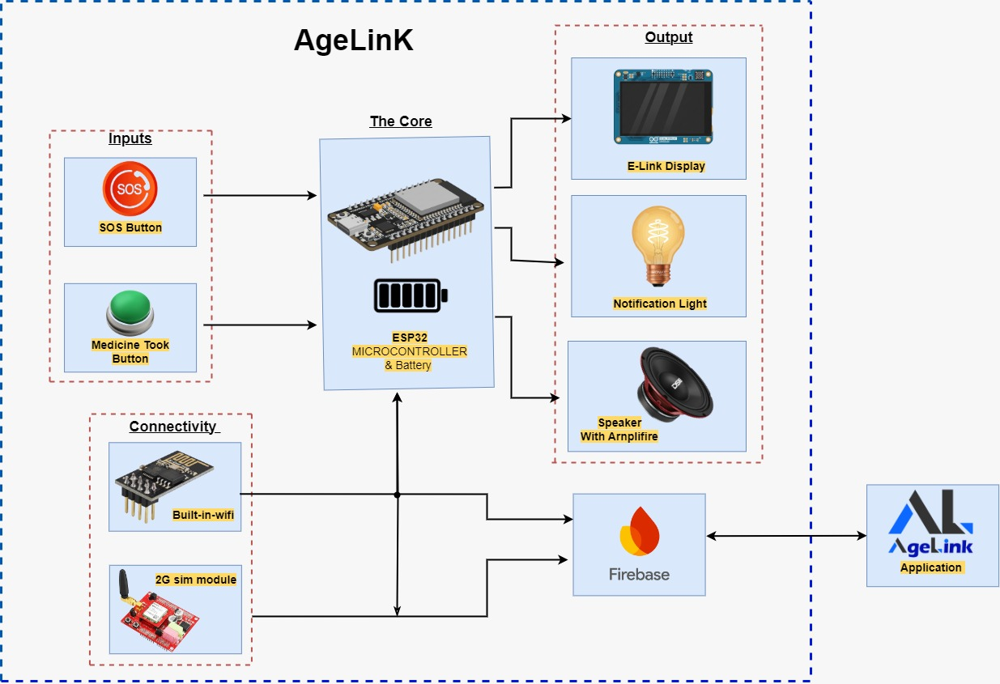

# AgeLink 🧓🔗
**Empowering independent elderly living through voice-assisted IoT.**

**Team:** Team XTurbo   
**Domain:** Healthcare & Elderly Care  

---

## 🛠️ Tech Stack Used
* **Frontend Mobile App:** Flutter (Dart) 
* **Backend & Cloud:** Firebase (Cloud Functions, Firestore)
* **Hardware Communication:** Bluetooth Low Energy (BLE) / Wi-Fi
* **Hardware/IoT (Associated):** ESP32, C++ (Arduino IDE)

---

## 🚀 Deployment Details
Currently, the mobile application is built to run locally on Android devices using the standard Flutter build tools. The backend relies on Firebase Cloud Functions, which are deployed to our Firebase project instance. 
* To test the app, please refer to the `TeamXTurbo.pdf` document for step-by-step setup and build instructions.
* **Environment Variables:** Please rename the provided `Example.env` to `.env` and use the placeholder structure provided. 

---

## 📐 Architecture / System Overview

**System Diagram:**
'

**Short Explanation:**
The AgeLink system consists of two main components: the physical hardware device (ESP32) used by the elderly individual, and this Flutter-based companion app used by their family members. 
1. The **Companion App** writes medication schedules and voice messages to Firebase Firestore.
2. The **AgeLink Device** periodically syncs with Firebase via Wi-Fi to download these schedules. 
3. When the SOS button is pressed on the device, or if a medication is missed, a trigger is sent to Firebase Cloud Functions, which dispatches push notifications and alerts directly to this companion app. 
4. **Bluetooth Setup:** The app utilizes Bluetooth (as seen in the `lib` and native folders) for the initial pairing and configuration of the AgeLink device's Wi-Fi credentials.

---

## 🧠 Technical Challenges & Creative Solutions

1. **Seamless Bluetooth Device Pairing:** 
   * **Challenge:** Ensuring family members could easily connect the app to the ESP32 hardware without complex network configurations. 
   * **Solution:** We implemented a custom BLE pairing sequence to safely transmit Wi-Fi credentials from the Flutter app to the hardware. 
   * **Files:** *[Link to your bluetooth configuration file, e.g., `lib/services/bluetooth_service.dart`]*

2. **Real-time Synchronization & Notifications:**
   * **Challenge:** Delivering instant emergency SOS alerts and missed medication notifications with absolute minimum latency.
   * **Solution:** Leveraged Firebase Cloud Functions to listen for Firestore document changes triggered by the hardware, which push FCM (Firebase Cloud Messaging) payloads instantly to the active app state.
   * **Files:** *[`firebase.json`](./firebase.json) and related cloud functions.*

3. **Intuitive Device Management UI:**
   * **Challenge:** Designing a single dashboard that handles schedule history, device status, and notifications without overwhelming the user.
   * **Solution:** Created a modular device page UI with distinct tabs for schedules and history, backed by efficient state management to update real-time battery and connection status.
   * **Files:** *[Link to your device page, e.g., `lib/pages/device_page.dart`]*

---

## ✅ Scope Delivered

* **Fully Implemented:** 
  * App UI/UX and Navigation (Navbar, App Logo, Launching).
  * Firebase Integration (Cloud Functions setup, Firestore connections, and real-time data syncing).
  * Bluetooth Connectivity (Initial pairing capability and Wi-Fi credential transfer).
  * Core App Functionalities (Adding medication schedules, viewing history, and notification dashboards).
  * SOS Emergency Alert System and single-language (English) automated voice reminders.
* **Partially Implemented / Future Scope:**
  * Family Voice Message Recording: The UI for recording is present in the app, but cloud storage optimization and device-side playback synchronization are still being refined.
  * Multi-Language Support: The core medication reminder flow is active in English, but dynamic translation into regional languages (via Google Cloud TTS integration) is in progress for the next development phase.
* **Not Implemented (By Choice for Prototype):**
  * Advanced Ecosystem Features: Features like the AI ChatBot, detailed healthcare reports, and diet plans (slated for Phase 2 in our scalability plan) were purposefully excluded from this initial prototype to focus strictly on perfecting the core emergency SOS and hardware-software reminder functionalities.

---

## 📝 Note

* **Hardware Dependency:** Please note that this mobile application is designed specifically as a companion to the AgeLink physical device. Without the active ESP32 hardware to trigger SOS alerts or confirm medication doses, the app's real-time event functionalities cannot be fully demonstrated in isolation.

---

## 🎥 Demonstration Video Link
**[Insert YouTube / Drive Link to your 360° Demo and Pitch Video Here]**
